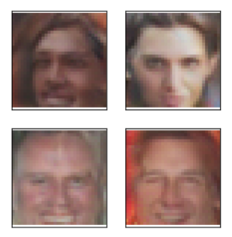

# Face_Generation

The fourth project of my [Deep Learning](https://www.udacity.com/course/deep-learning-nanodegree--nd101) Nanodegree from [Udacity](https://www.udacity.com/), see the [Completion Certificate](https://graduation.udacity.com/confirm/QCK3UKSS).

In this project I define and train a `Deep Convolutional Generative Adversarial Networks` (DCGAN) using the [CelebFaces Attributes Dataset (CelebA)](http://mmlab.ie.cuhk.edu.hk/projects/CelebA.html) to train the adversarial networks.

The goal is to get a generator network to generate new images of realistically looking faces with small amounts of noise. See the solution in the [dlnd_face_generation_my_solution.ipynb](https://github.com/viktor-begun/Deep_Learning_Face_Generation/blob/main/dlnd_face_generation_my_solution.ipynb) file.

**Example of generated faces (32x32):**

**Libraries and methods used:** `matplotlib.pyplot`, `NumPy`, `os`, `pickle`, `torch:` `.nn.functional`, `.nn.init`, `.optim`, `.utils.data.DataLoader`; `torchvision:` `.datasets`, `.transforms`, `unittest`.
